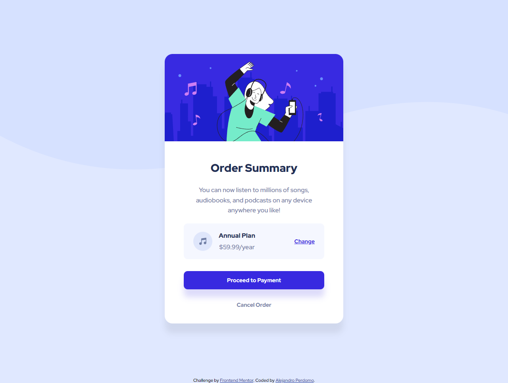

# Frontend Mentor - Order summary card solution

This is a solution to the [Order summary card challenge on Frontend Mentor](https://www.frontendmentor.io/challenges/order-summary-component-QlPmajDUj). Frontend Mentor challenges help you improve your coding skills by building realistic projects.

## Table of contents

- [Overview](#overview)
  - [The challenge](#the-challenge)
  - [Screenshot](#screenshot)
  - [Links](#links)
- [My process](#my-process)
  - [Built with](#built-with)
  - [What I learned](#what-i-learned)
- [Author](#author)

## Overview

### The challenge

Users should be able to:

- See hover states for interactive elements

### Screenshot

### Links

- Solution URL: [Front end Mentor Solution](https://www.frontendmentor.io/solutions/responsive-order-summary-with-just-flexbox-and-media-queries-bvN0FT2G9N)
- Live Site URL: [Order Summary](https://order-summary-alejandro.netlify.app)

## My process

### Built with

- Semantic HTML5 markup
- CSS custom properties
- Flexbox
- Desktop-first workflow

### What I learned

This challenge helped me play around a bit more with responsive web design and flexbox layouts.

## Author

- Frontend Mentor - [@Cavalry2010](https://www.frontendmentor.io/profile/Cavalry2010)
- Twitter - [@AlPerdomoMC](https://www.twitter.com/AlPerdomoMC)
- GitHub - [@Cavalry2010](https://www.github.com/Cavalry2010)
